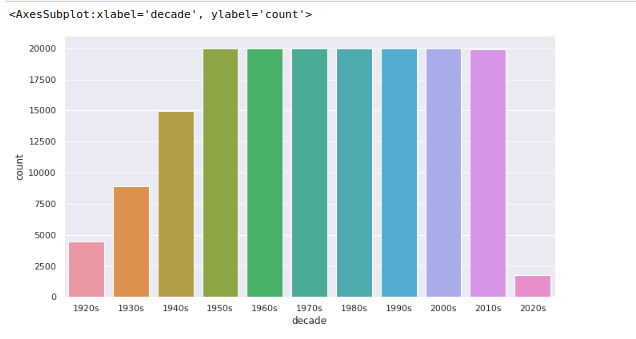
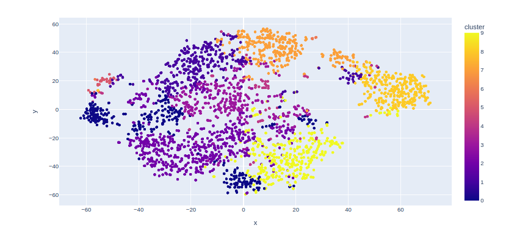

<div align="center"> 
  <p align='center'> 
   
   
   <br>
   
    <br>
   <br>
  </p>  
 </div>
 
<div align="center"> 
  
  <br/>
   
  <br><br>
  
</div>

 <div align="center">
 <p>
 <br>
   <br>
   <br><strong>Ceol</strong> is available under MIT License, read the LICENSE file for more info
  <p>
 </div>
 <hr>

<div align="center"> 
  
  <br><br>
  <p float="left">
  
  
  
  
  </p>
</div>

  
<div align="center"> 
   
</div>
  <br>
  
  ```
 
 - Python(3.9+):
 - Poetry: For python dependency management
  
 ```

  
<div align="center"> 
   
</div>

   ```
   git clone https://github.com/<your_username>/Ceol.git   
   ```   

   ```
   cd Ceol/ceol
   
   # Adding the spotify credentials
   nano .env
   
     SPOTIFY_CLIENT_ID=" "
     SPOTIFY_CLIENT_SECRET=" "
   ```

   ```
   curl -sSL https://raw.githubusercontent.com/python-poetry/poetry/master/get-poetry.py | python -
   poetry install
   poetry run jupyter notebook
   ```

  
<div align="center"> 
   
</div>
  <br>
  
  ```
  Python 3.7+
  - numpy
  - pandas
  - scikit-learn
  - matplotlib
  - seaborn
  - plotly
  - spotipy
  - sklearn
  ```
  
  <div align="center"> 
   
</div>
  <br>

    
<div align="center"> 
  <table>
<tr align="center">

<td>

Swarnabha Das

<p align="center">

</p>
<p align="center">
<a href = "https://github.com/sd2001"></a>
<a href = "https://www.linkedin.com/in/swarnabha-das-2001official/">

</a>
</p>
</td>


  </table>
</tr>
</div>
  <br>
  
  
<div align="center">
  
 </div>
